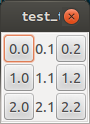
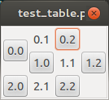
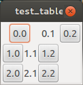

************
Table Widget
************

============================
How to create a table widget
============================

This is table version 2 ``tableV2``, and there also had a ``table`` widget, but it does not support `tr` `td` layout

.. code-block:: python

   import gtk
   import xmlgtk
   XML_DATA='''
   <frame>
   <tableV2>
   <tr><td><button text="0.0" /></td><td><label text="0.1" /></td><td><button text="0.2" /></td></tr>
   <tr><td><button text="1.0" /></td><td><label text="1.1" /></td><td><button text="1.2" /></td></tr>
   <tr><td><button text="2.0" /></td><td><label text="2.1" /></td><td><button text="2.2" /></td></tr>
   </tableV2>
   </frame>
   '''
   xml_obj = xmlgtk.xmlgtk(XML_DATA)
   win = gtk.Window(gtk.WINDOW_TOPLEVEL)
   win.add(xml_obj.widget)
   win.show()
   gtk.main()

The xml_data can be simple, remove `td` tag.

.. code-block:: html

   <frame>
   <tableV2>
   <tr><button text="0.0" /><label text="0.1" /><button text="0.2" /></tr>
   <tr><button text="1.0" /><label text="1.1" /><button text="1.2" /></tr>
   <tr><button text="2.0" /><label text="2.1" /><button text="2.2" /></tr>
   </tableV2>
   </frame>

We can add ``rowspan`` and ``colspan`` attributes to layout the table.

.. code-block:: html

   <frame>
   <tableV2>
   <tr><button rowspan="2" text="0.0" /><label text="0.1" /><button text="0.2" /></tr>
   <tr><button text="1.0" /><label text="1.1" /><button text="1.2" /></tr>
   <tr><button text="2.0" /><label text="2.1" /><button text="2.2" /></tr>
   </tableV2>
   </frame>
   
The result looks like:

.. code-block:: html

   <frame>
   <tableV2>
   <tr><button colspan="2" text="0.0" /><label text="0.1" /><button text="0.2" /></tr>
   <tr><button text="1.0" /><label text="1.1" /><button text="1.2" /></tr>
   <tr><button text="2.0" /><label text="2.1" /><button text="2.2" /></tr>
   </tableV2>
   </frame>

